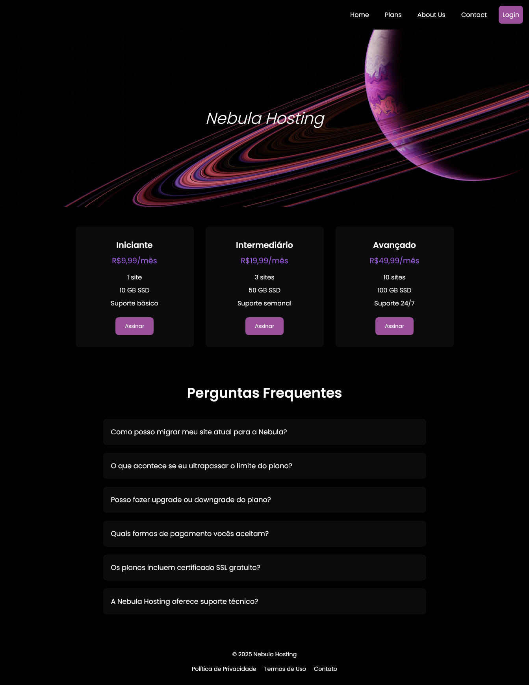

# 🌌 Nebula Hosting

**Nebula Hosting** é uma página de apresentação moderna e responsiva para uma empresa de hospedagem de sites.  
O projeto destaca diferentes planos de serviço, informações de suporte e uma seção de perguntas frequentes, tudo em um design escuro elegante e futurista.

---

## 🧭 Sobre o Projeto
A **Nebula Hosting** foi criada para simular uma landing page de hospedagem web, com foco em clareza, estética e usabilidade.  
O layout apresenta:

- 💫 **Seção principal (hero)** com o nome da marca e um visual espacial envolvente  
- 💻 **Planos de hospedagem** com preços e recursos destacados  
- ❓ **Sessão de Perguntas Frequentes (FAQ)** interativa e informativa  
- ⚫ **Design escuro (dark mode)** com contraste roxo e tipografia limpa

---

---